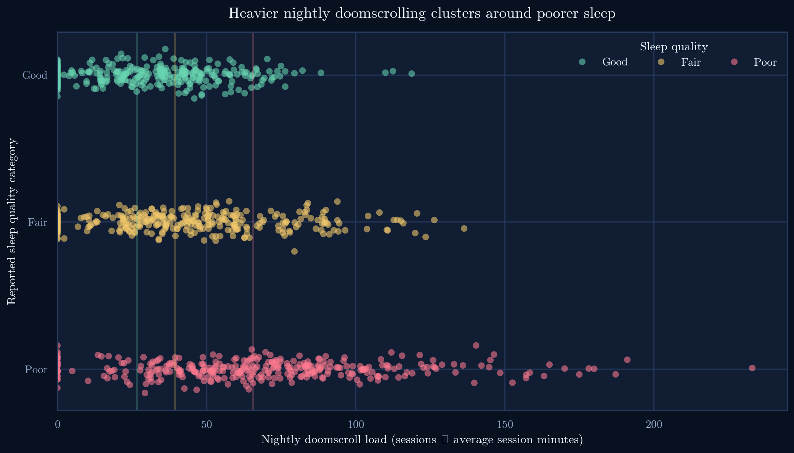
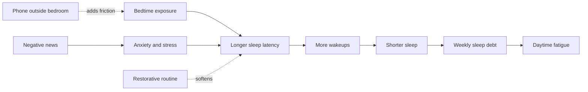
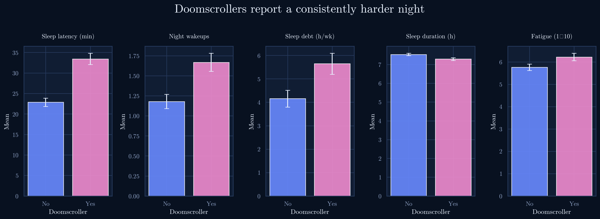
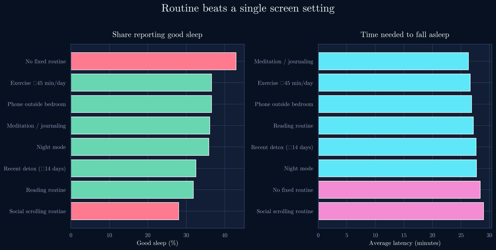
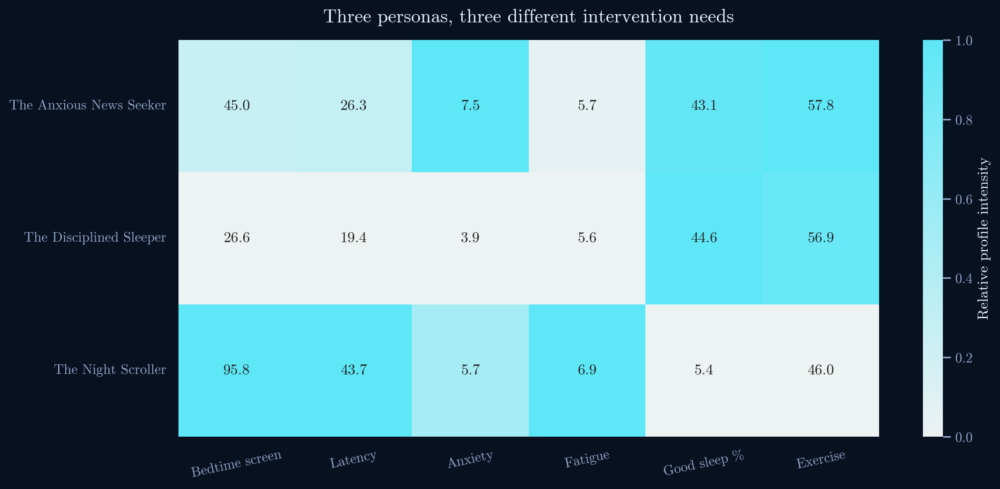
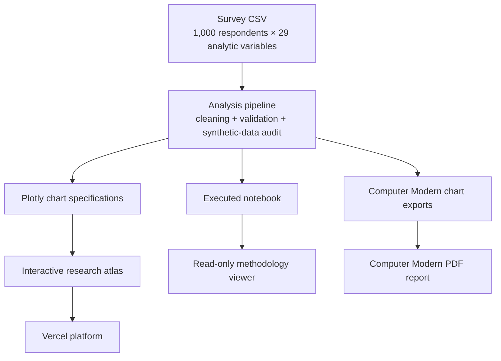
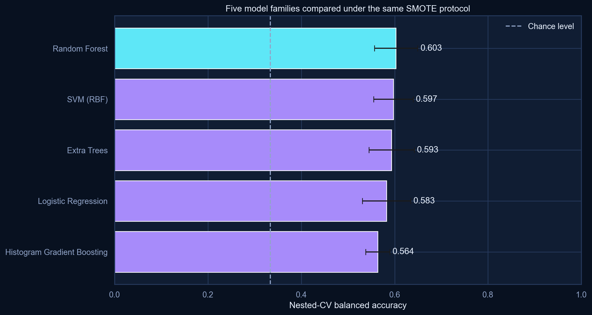
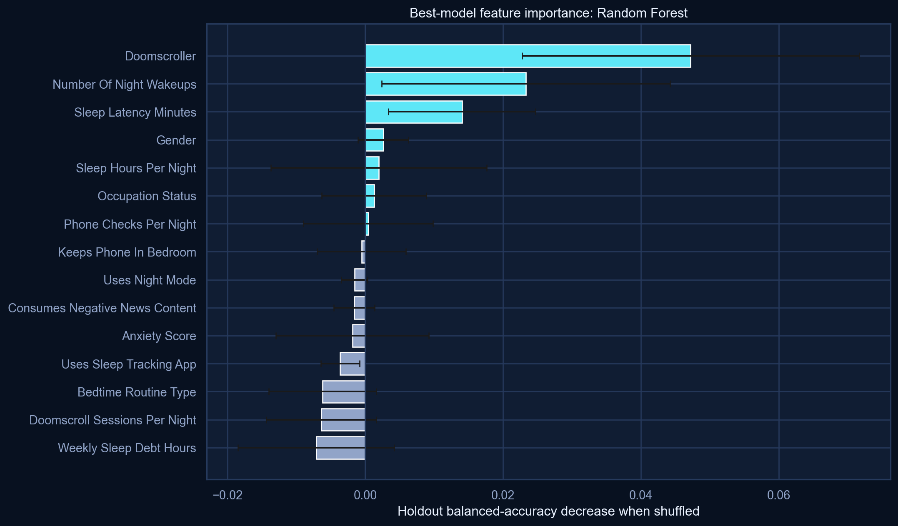

# Night Signals — Sleep × Doomscrolling

Night Signals is an evidence-led analysis of how late-night scrolling, negative-news consumption, and bedtime routines relate to sleep and mental wellbeing across 1,000 respondents. The project combines separate executed analysis and predictive-modelling notebooks, a Computer Modern–typeset PDF report, and a cinematic React research atlas with interactive Plotly figures.



## What the analysis finds

- Doomscrollers average **10.6 additional minutes of sleep latency**.
- They carry **1.5 more hours of weekly sleep debt** and sleep about **15 minutes less per night**.
- Anxiety, stress, and fatigue are highest where doomscrolling and negative-news consumption coexist.
- Reading, meditation or journaling, phone distance, and exercise look more protective than night mode alone.
- Only **11 of 204 heavy doomscrollers** still report good sleep—the project’s counter-narrative.
- Five model families are compared with the same leakage-safe SMOTENC and nested-CV protocol.
- Random Forest leads nested cross-validation at **60.3% balanced accuracy**, narrowly ahead of RBF SVM (**59.7%**) and Extra Trees (**59.3%**), against a **34% majority-class baseline**.
- The ranking is based on nested cross-validation; the untouched holdout remains a final diagnostic rather than a model-selection shortcut.

## Analytical story



The project treats this as a bedtime-disruption chain, not a morality tale. Exposure is a risk signal; environment, content, and routine shape whether that risk becomes an outcome.

## Evidence atlas

| Theme | Main result |
|---|---|
| Core relationship | Latency, wakeups, debt, duration, and fatigue move consistently in the harder-sleep direction. |
| Mental wellbeing | Doomscrolling and negative news stack up around the highest distress averages. |
| Protective habits | Reading and meditation or journaling outperform social scrolling; night mode alone is weak. |
| Demographics | Younger and student pockets are elevated, but breakdowns are descriptive rather than rankings. |
| The Exceptions | Good-sleep heavy scrollers show more realized sleep and lower debt or latency. |
| Synthesis | Behavioral exposure and sleep mechanics lead the predictor ranking. |





### The Exceptions


Heavy exposure does not fully determine the outcome. The exception group is small and exploratory, but it redirects attention toward routines, realized sleep, and environmental friction.

### Personas



| Persona | Defining pattern | First intervention lever |
|---|---|---|
| The Night Scroller | Self-identified doomscroller in the top bedtime-exposure quartile | Environmental friction |
| The Anxious News Seeker | Negative-news consumption with high anxiety and stress | Content boundaries |
| The Disciplined Sleeper | Lower exposure with reading or meditation or journaling | Routine maintenance |

## Project architecture



The website opens with a single-screen cinematic entry and continues into five research surfaces:

- **Overview** — central thread, key metrics, and hero evidence.
- **All analysis** — 13 responsive Plotly figures with filters, zoom, hover detail, and written interpretations.
- **The Exceptions** — the good-sleep heavy-scroller counter-pattern.
- **Personas** — three intervention-oriented respondent profiles.
- **Methodology** — workflow, synthetic-data checks, model boundaries, and switchable viewers for both executed notebooks.

## Repository map

```text
night-signals-doomscrolling-analysis/
├── data/
│   └── sleep_doomscrolling_habits.csv   # Source dataset
├── deliverables/
│   └── Sleep_Doomscrolling_Report.pdf   # Sole report export
├── notebooks/
│   └── sleep_doomscrolling_analysis.ipynb
├── outputs/
│   ├── analysis_summary.json            # Final reusable metrics
│   ├── figures/                         # Publication-ready chart exports
│   └── tables/                          # Final analytical tables
├── public/
│   ├── data/plotly_charts.json          # Website chart specifications
│   ├── downloads/                       # PDF report
│   └── methodology/                     # Notebook used by the viewer
├── src/
│   ├── App.tsx                          # Routes, Plotly figures, and notebook viewer
│   ├── main.tsx                         # React entry point
│   └── styles.css                       # Cinematic + research-atlas visual system
├── index.html
├── vercel.json
└── README.md
```

The repository intentionally contains final research artifacts and the deployable frontend only. One-off generation scripts and loose intermediate files are excluded from the published project.

## Methodology

The workflow:

1. Validates IDs, duplicates, dtypes, missingness, and plausible ranges.
2. Labels missing categorical values `Unknown` and median-imputes numeric values in the analysis frame.
3. Creates Teens (15–19), 20s (20–29), and 30s+ age buckets.
4. Tests for exact formulas, ceiling effects, balanced targets, and unusually strong correlations.
5. Answers nine research questions using comparisons, quartiles, exception rules, and transparent personas.
6. Compares Logistic Regression, Random Forest, Extra Trees, RBF SVM, and Histogram Gradient Boosting with leakage-safe `SMOTENC`, randomized tuning, nested stratified five-fold cross-validation, and an untouched holdout.





The outcome-adjacent `sleep_quality_score` is excluded from the classifier to reduce construct-overlap leakage.

## Synthetic-data caveat

The dataset is unusually orderly: sleep hours and weekly debt correlate at approximately **−0.893**, more than **86%** of valid sleep-quality scores are **5/5**, and only ten respondents separate the three target classes. These signals are consistent with synthetic or simulation-assisted data, so the project uses descriptive, non-causal language and does not generalize rates to a wider population.

## Visual system

The landing page adapts the supplied cinematic black-and-white composition to Night Signals: full-bleed motion, sharp translucent controls, Sora display type, JetBrains Mono interface copy, and a responsive circular mobile menu. The research atlas shifts into a midnight evidence palette while preserving the same typographic discipline.

| Token | Color | Use |
|---|---|---|
| Pure black | `#000000` | Cinematic entry |
| Midnight | `#07111F` | Research background |
| Moonlight cyan | `#59D8E8` | Primary signal and focus |
| Sleep blue | `#6F8CFF` | Structural emphasis |
| Alert pink | `#EF83BB` | Disruption and risk |
| Dawn gold | `#EFC36B` | Caveats and content load |
| Rest mint | `#64D6AD` | Protective habits |

## Responsible interpretation

Night Signals is not medical advice and does not claim causality. Country and gender comparisons are descriptive only; small subgroup findings remain exploratory; and personas are design tools rather than diagnoses.
