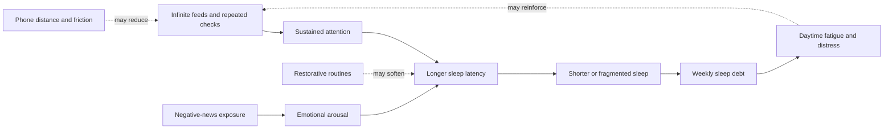
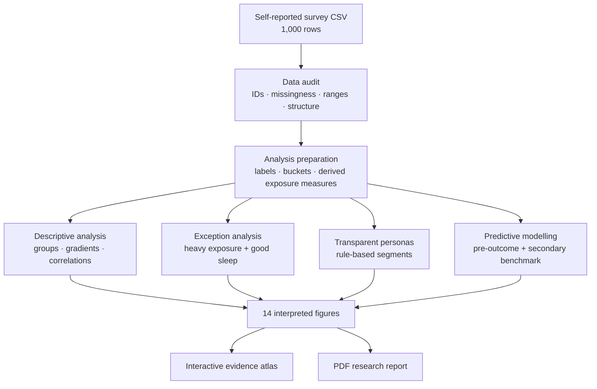
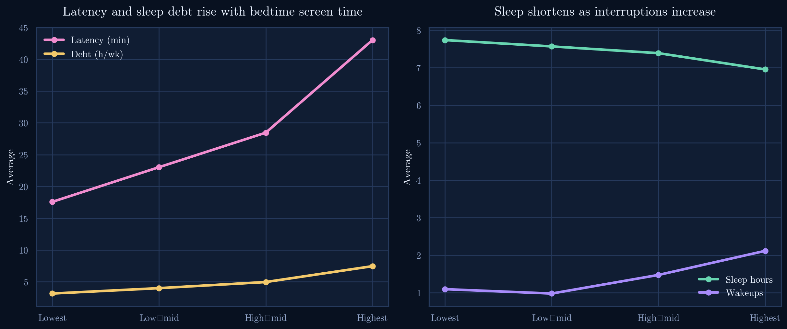
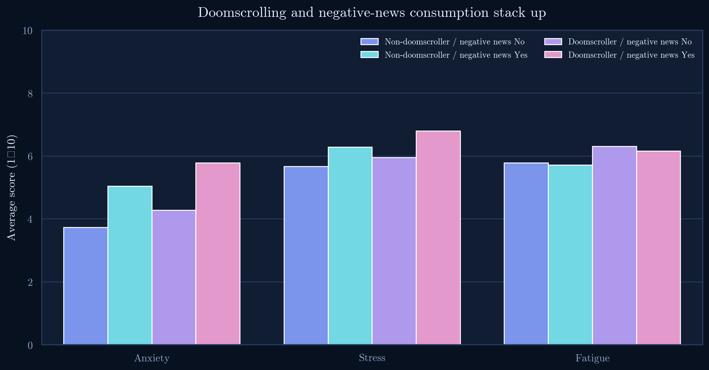
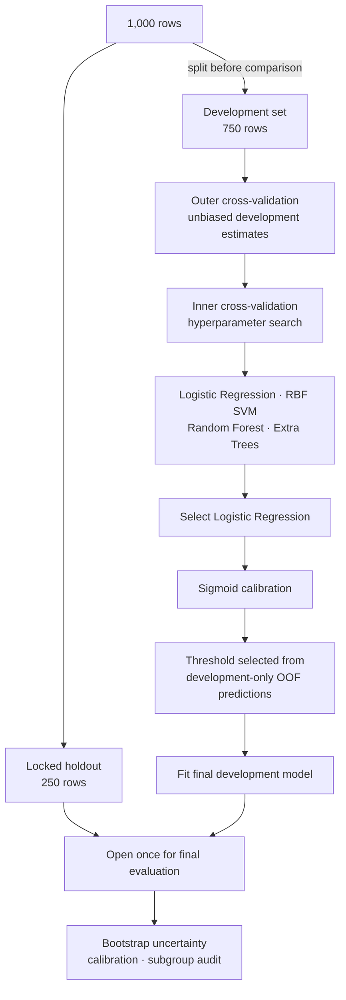
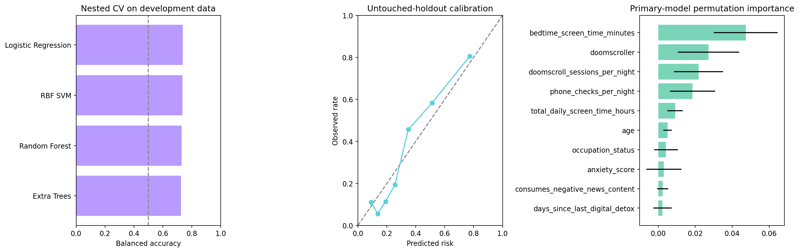

# Night Signals — Sleep × Doomscrolling

<p align="center">
  
</p>

<p align="center">
  <strong>An evidence-led study of how doomscrolling, negative-news exposure, and bedtime routines relate to sleep and mental wellbeing.</strong>
</p>

<p align="center">
  <a href="https://night-signals-doomscrolling-analysi.vercel.app">Explore the research atlas</a> ·
  <a href="deliverables/Sleep_Doomscrolling_Report.pdf">Read the report</a> ·
  <a href="notebooks/sleep_doomscrolling_analysis.ipynb">Analysis notebook</a> ·
  <a href="notebooks/sleep_doomscrolling_predictive_modeling.ipynb">Modelling notebook</a>
</p>

## Project overview

Night Signals studies the tension between always-on digital information and the finite human need for rest. It asks a more useful question than “are phones bad for sleep?”: **how do exposure intensity, content, emotional state, and protective routines combine around sleep outcomes—and which signals are available early enough to support prevention?**

The project brings together:

- an audited self-reported survey of **1,000 respondents** and **29 analytic variables**;
- two independent external-evidence layers — **NHANES 2021-2023** (8,040 adults; sleep vs. blood pressure, BMI, activity) and **PhysioNet Sleep-Accel** (31 subjects; heart rate over polysomnography-scored sleep stages), analysed without row-merging;
- two fully executed Jupyter notebooks for descriptive analysis and predictive modelling;
- **14 publication-ready figures** with interpretation, practical relevance, and analytical boundaries;
- an interactive React research atlas with accessible Plotly charts;
- a leakage-safe pre-outcome risk model with nested cross-validation, calibration, uncertainty intervals, and subgroup diagnostics;
- a typeset PDF report and versioned analytical artifacts.

This is an educational data-science project. It does not claim that doomscrolling causes poor sleep, estimate population prevalence, or provide medical advice.

## The problem

Bedtime should be a period of decreasing stimulation. Infinite feeds remove stopping cues, repeated checking fragments attention, and emotionally charged news can sustain alertness when the mind needs to disengage. The result may appear across the whole night: delayed sleep onset, shorter realized sleep, more awakenings, accumulated sleep debt, and next-day fatigue.

The analytical problem is therefore:

> We lack a clear, evidence-led account of how doomscrolling intensity, negative-news exposure, and bedtime routines combine around sleep—and which modifiable behaviours may reduce risk without treating screen use as destiny.

### Research questions

1. How do bedtime screen time and doomscroll intensity relate to sleep quality?
2. Which sleep outcomes change most clearly with heavier exposure?
3. Do anxiety, stress, and negative-news consumption compound the pattern?
4. Which routines and environmental choices appear protective?
5. Does the relationship follow a dose-shaped gradient?
6. Which demographic or occupational contexts require cautious interpretation?
7. What distinguishes heavy scrollers who still report good sleep?
8. Can transparent personas translate evidence into different intervention needs?
9. Can poor-sleep risk be estimated **before** sleep outcomes are known?

## The analytical story

Night Signals frames the evidence as a reinforcing bedtime-disruption chain rather than a morality tale.



The arrows describe a hypothesis supported by patterns in this self-reported survey dataset. They are **not** causal estimates.

## Dataset

The source is a self-reported, cross-sectional survey containing 1,000 rows. It combines behaviour, context, self-reported wellbeing, sleep outcomes, and protective habits.

| Variable family | Examples | Role in the study |
|---|---|---|
| Demographics | Age, gender, occupation, country/region | Context and subgroup description |
| Digital exposure | Daily screen time, bedtime screen time, phone checks | Exposure intensity |
| Doomscroll behaviour | Sessions per night, average session length, doomscroller label | Core behavioural signal |
| Content and wellbeing | Negative news, anxiety, stress | Emotional context |
| Sleep outcomes | Duration, latency, awakenings, debt, fatigue, quality | Outcomes and descriptive consequences |
| Protective behaviour | Reading, meditation/journaling, exercise, digital detox | Potential protective signals |
| Environment | Phone in bedroom, device, night mode, tracking app | Modifiable context |

### Data-quality audit

The workflow checks respondent IDs, duplicates, missingness, dtypes, valid ranges, target balance, exact formulas, ceiling effects, and unusually strong correlations. Missing categorical values are represented explicitly; numeric imputation occurs inside the relevant analytical or modelling pipeline.

Several patterns indicate a generator-shaped dataset:

- **220 missing cells** are distributed across six variables;
- sleep hours and weekly sleep debt correlate at approximately **−0.893**;
- more than **86%** of valid sleep-quality scores sit at the 5/5 ceiling;
- only ten respondents separate the three sleep-quality classes.

These properties make the data useful for demonstrating a complete workflow, but unsuitable for population or clinical claims.

## Analysis workflow



The project keeps descriptive questions, exception discovery, persona construction, and predictive modelling distinct. This prevents a model score from replacing the broader research question.

## Main findings

### 1. Heavier scrolling clusters around poorer sleep


Poor sleepers carry the highest median nightly doomscroll load. The distributions still overlap substantially, which matters: exposure is associated with risk but does not make an outcome inevitable.

### 2. The difference appears across multiple sleep outcomes


In this dataset, doomscrollers average:

- **10.6 additional minutes** of sleep latency;
- **1.5 additional hours** of weekly sleep debt;
- approximately **15 fewer minutes** of sleep per night;
- more awakenings and higher daytime fatigue.

The consistency across outcomes is more informative than any single metric.

### 3. The relationship is dose-shaped



Higher bedtime-screen quartiles generally show longer latency and more sleep debt. A gradient is practically useful because it suggests that improvement need not require an all-or-nothing digital detox.

### 4. Negative news and doomscrolling stack up



Anxiety, stress, and fatigue are highest where doomscrolling and negative-news consumption coexist. Because the data is cross-sectional, the direction remains unresolved: distress may promote scrolling, follow it, or participate in a feedback loop.

### 5. Routine appears more useful than a display setting


Reading and meditation/journaling are more consistently associated with better sleep than night mode alone. Exercise and phone distance also look supportive. These are intervention hypotheses, not proven treatments.

### 6. Exceptions prevent a deterministic conclusion


Only **11 of 204** heavy scrollers report good sleep. This group realizes more sleep and less debt or latency, with restorative routines appearing more often. The sample is too small for stable effect estimates, but it redirects attention toward protective mechanisms.

### 7. Personas translate evidence into different needs


| Persona | Pattern | Most relevant design lever |
|---|---|---|
| The Night Scroller | High bedtime exposure and repeated sessions | Environmental friction and stopping cues |
| The Anxious News Seeker | Negative-news consumption with elevated distress | Content boundaries and emotional decompression |
| The Disciplined Sleeper | Lower exposure with restorative routines | Routine maintenance |

Personas are transparent rule-based design tools, not diagnoses or hidden clusters.

## Predictive modelling

The project deliberately retains two different prediction tasks. Their scores are **not directly comparable**.

| Task | Target | Purpose | Validation result |
|---|---|---|---|
| Primary model | Poor vs not-poor sleep | Pre-outcome bedtime screening demonstration | 73.7% nested-CV balanced accuracy; 77.5% untouched holdout |
| Secondary benchmark | Good vs fair vs poor sleep | Harder three-class research comparison | ≈60% nested-CV balanced accuracy |

### Primary pre-outcome model

The primary task asks what can be estimated at bedtime, before the night’s outcome is observed. It excludes respondent ID, sleep duration, latency, awakenings, weekly sleep debt, daytime fatigue, sleep-quality score, and the target label.



Nominal categories are one-hot encoded. All preprocessing and tuning occur inside the appropriate folds. False negatives receive twice the cost of false positives when selecting the development-only threshold.

### Model comparison


| Candidate | Nested-CV balanced accuracy | Status |
|---|---:|---|
| Logistic Regression | **73.7%** | Selected and calibrated |
| RBF SVM | 73.5% | Development comparison only |
| Random Forest | 73.0% | Development comparison only |
| Extra Trees | 72.5% | Development comparison only |

### Final evaluation



| Metric | Untouched holdout result |
|---|---:|
| Balanced accuracy | **77.5%** |
| Bootstrap 95% interval | 71.8–82.8% |
| ROC AUC | 82.5% |
| PR AUC | 72.0% |
| Sensitivity | 75.9% |
| Specificity | 79.0% |
| Brier score | 0.155 |
| Decision threshold | 0.32 |

The binary majority baseline is **67%**, so the model should be understood as a measured improvement over a strong baseline—not as a 77.5-point gain. External validation has not been performed.

### Secondary three-class benchmark

The Good/Fair/Poor benchmark uses a fold-contained SMOTENC pipeline and nested tuning. It is retained because it demonstrates a harder multiclass problem and shows why accuracy cannot be compared across different targets, class structures, and baselines. Its feature-importance figure explains the secondary Random Forest only, not the primary Logistic Regression.

## Research atlas

The website turns the notebooks and artifacts into eight connected research surfaces:

| Page | Purpose |
|---|---|
| Overview | Central narrative, key indicators, and hero evidence |
| Problem statement | Detailed context, stakeholders, research questions, scope, and boundaries |
| Evidence synthesis | Independent external-evidence layers — NHANES population health and PhysioNet physiology — analysed without row-merging (RQ5) |
| All analysis | Fourteen interactive figures with accessible data tables and interpretations |
| Modelling | Candidate comparison, validation design, uncertainty, fairness audit, and risk demo |
| The Exceptions | Counter-pattern among high-exposure respondents with good sleep |
| Personas | Transparent intervention-oriented profiles |
| Methodology | Executed notebook outputs, audit logic, and reproducibility details |

The visual system moves from a cinematic night-time entry into a quieter editorial atlas. The shared image language, typography, subdued motion, and midnight palette keep the landing and research pages part of the same project.

## Project structure

```text
night-signals-doomscrolling-analysis/
├── data/
│   └── sleep_doomscrolling_habits.csv
├── notebooks/
│   ├── sleep_doomscrolling_analysis.ipynb
│   └── sleep_doomscrolling_predictive_modeling.ipynb
├── outputs/
│   ├── figures/                 # Publication-ready evidence
│   ├── tables/                  # Model, persona, and audit tables
│   ├── models/                  # Versioned reproducibility artifacts
│   └── analysis_summary.json
├── deliverables/
│   └── Sleep_Doomscrolling_Report.pdf
├── public/
│   ├── assets/                  # Atlas imagery
│   ├── data/                    # Chart specs, schema, registry, subgroup audit
│   └── methodology/             # Notebook data shown by the atlas
├── src/
│   ├── components/              # Problem page, charts, and risk interface
│   ├── App.tsx                  # Research routes and page composition
│   └── styles.css               # Visual system and responsive layouts
├── MODEL_CARD.md
├── EXTERNAL_VALIDATION.md
└── README.md
```

## Reproducible research artifacts

The repository contains the evidence needed to inspect the project rather than only screenshots of results:

- [descriptive analysis notebook](notebooks/sleep_doomscrolling_analysis.ipynb);
- [predictive-modelling notebook](notebooks/sleep_doomscrolling_predictive_modeling.ipynb);
- [model card](MODEL_CARD.md);
- [external-validation protocol](EXTERNAL_VALIDATION.md);
- [model registry](public/data/model_registry.json);
- [prediction input schema](public/data/prediction_schema.json);
- [subgroup performance audit](public/data/subgroup_performance.csv);
- external evidence layers (RQ5), regenerated from public sources by
  [`scripts/build_nhanes_evidence.py`](scripts/build_nhanes_evidence.py) →
  [`nhanes_summary.json`](public/data/nhanes_summary.json) and
  [`scripts/build_physionet_evidence.py`](scripts/build_physionet_evidence.py) →
  [`physionet_summary.json`](public/data/physionet_summary.json) (raw NHANES/PhysioNet
  files download on first run into `external/`, which is git-ignored);
- [final PDF report](deliverables/Sleep_Doomscrolling_Report.pdf).

## Limitations

1. **Self-reported survey:** models may recover survey-specific structure and unverified sampling rather than generalizable human behaviour.
2. **Cross-sectional design:** temporal order and causality cannot be established.
3. **Self-report:** behaviour, wellbeing, and sleep measures may contain measurement error.
4. **Ceiling effects:** sleep-quality scores have limited variation.
5. **Small subgroups:** exception and subgroup estimates can be unstable.
6. **Internal validation only:** no independent, temporal, geographic, prospective, or clinical cohort has been tested.
7. **Screening, not diagnosis:** the model is an educational pre-outcome demonstration and must not drive medical, employment, insurance, or automated decisions about people.

## Responsible interpretation

Night Signals supports three defensible conclusions:

- bedtime exposure is associated with a coherent cluster of harder-sleep outcomes in this dataset;
- content, environment, and routine appear to matter alongside total screen time;
- predictive performance is promising enough to motivate independent validation, but not enough to justify real-world clinical use.

The most important result is not that every screen causes poor sleep. It is that **risk is patterned, protective context matters, and better questions produce more useful interventions than blame.**
