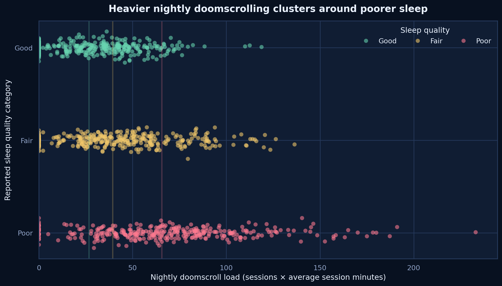
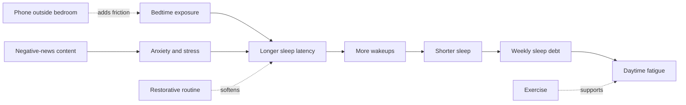
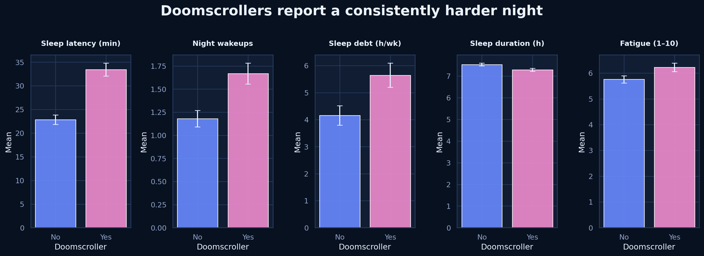
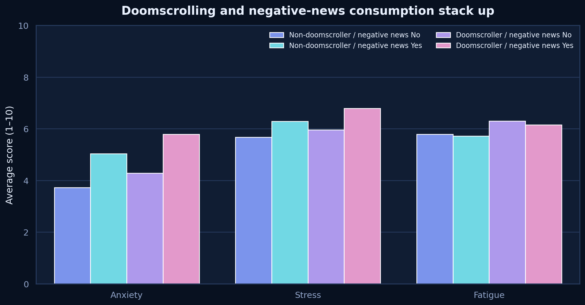
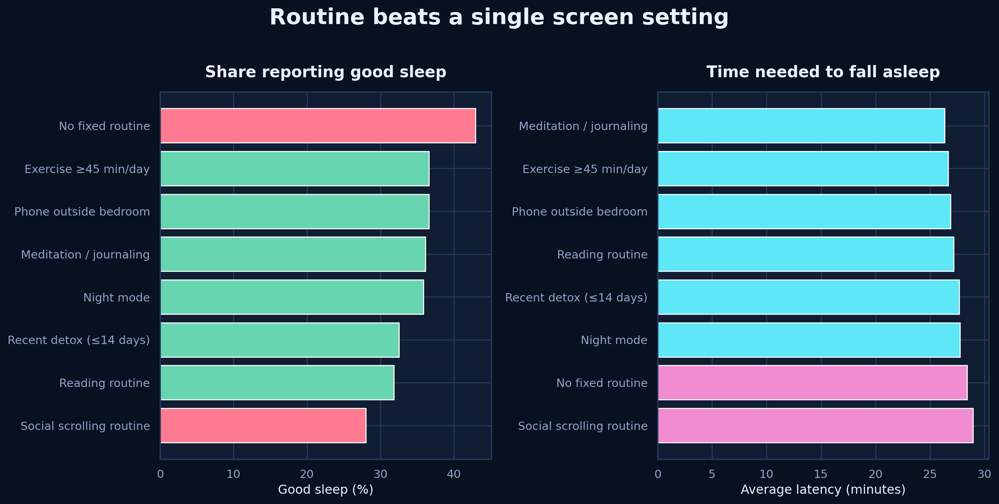
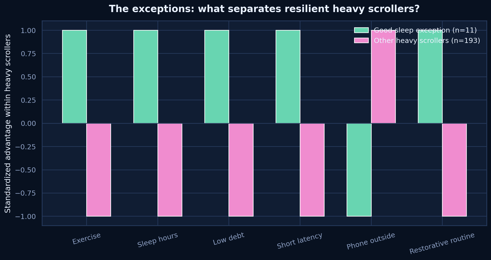
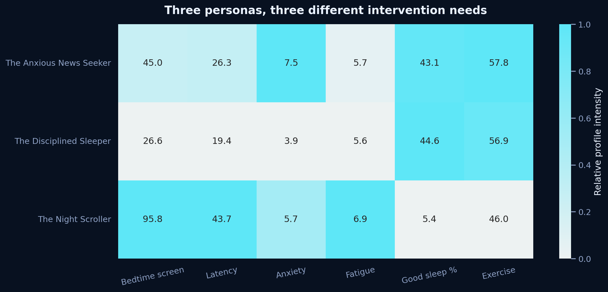
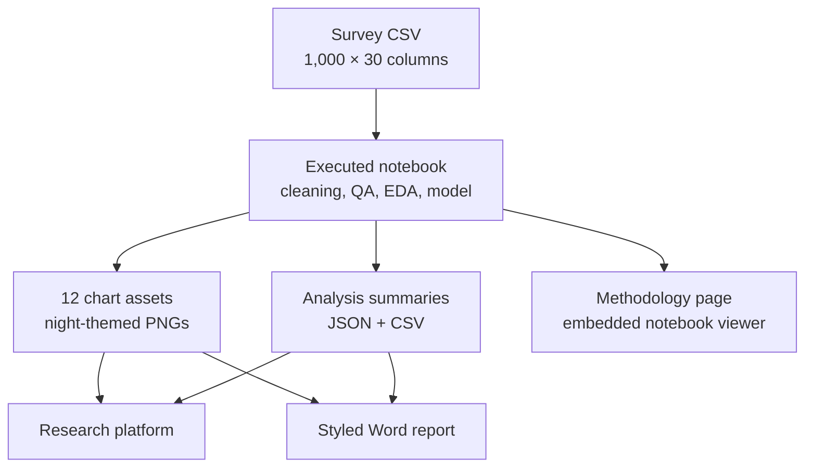
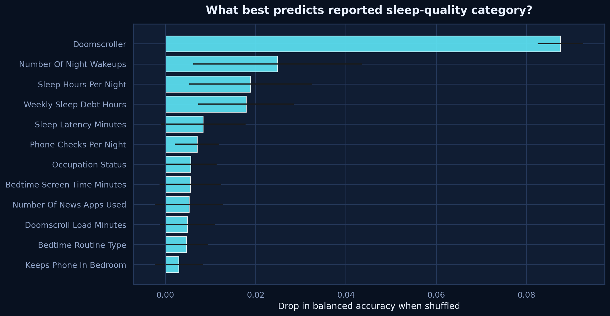

# Night Signals — Sleep × Doomscrolling

Night Signals is an evidence-led visual atlas of how late-night scrolling, negative-news consumption, and bedtime routines relate to sleep quality and mental wellbeing across 1,000 respondents.

The project combines a reproducible analysis notebook, a publication-ready report, and a responsive research platform. Its visual language adapts SkillLens’ dark glass surfaces, compact evidence cards, sidebar navigation, and methodology transparency to a midnight sleep theme.



## What the analysis finds

- Doomscrollers average **10.6 additional minutes of sleep latency**.
- They carry **1.5 more hours of weekly sleep debt** and sleep about **15 minutes less per night**.
- Anxiety, stress, and fatigue are highest where doomscrolling and negative-news consumption coexist.
- Reading, meditation/journaling, keeping the phone outside the bedroom, and exercise show more protective patterns than night mode alone.
- Only **11 of 204 heavy doomscrollers** still report good sleep—the project’s central counter-narrative.
- The predictive model reaches **60.3% balanced accuracy** against a **34% majority-class baseline**.

## The analytical story



The project treats this as a bedtime-disruption chain, not a morality tale. Exposure is a risk signal; environment, content, and routine shape whether that risk becomes an outcome.

## Evidence atlas

### Core relationship



The binary label points in a consistent direction across latency, wakeups, debt, duration, and fatigue. Quartile analysis then shows the richer dose-response pattern hidden inside that label.


### Mental wellbeing



The dual-exposure group—doomscrolling plus negative news—shows the heaviest anxiety, stress, and fatigue profile. Because the dataset is cross-sectional, the direction of the relationship remains unresolved.

### Protective habits



Routine and environment stand out more clearly than a single display setting. Reading and meditation/journaling outperform a social-scrolling routine; phone distance and movement provide additional protective signals.

### The Exceptions



The exception group is intentionally framed as the counter-narrative. It is small, but it shows that heavy exposure does not fully determine the outcome.

### Personas



The personas are transparent rule combinations rather than diagnoses or opaque clusters:

| Persona | Defining pattern | First intervention lever |
|---|---|---|
| The Night Scroller | Self-identified doomscroller in the top bedtime-exposure quartile | Environmental friction |
| The Anxious News Seeker | Negative-news consumption with high anxiety and stress | Content boundaries |
| The Disciplined Sleeper | Lower exposure with reading or meditation/journaling | Routine maintenance |

## Platform structure



The platform has five primary surfaces:

- **Overview** — hero finding, key metrics, and the central behavioral chain.
- **All analysis** — all 12 notebook figures with question-based filters and expandable interpretations.
- **The Exceptions** — the good-sleep heavy-scroller counter-pattern.
- **Personas** — three intervention-oriented respondent profiles.
- **Methodology** — workflow, synthetic-data checks, model boundaries, and an embedded viewer for the executed notebook.

## Repository map

```text
night-signals-doomscrolling-analysis/
├── assets/charts/                 # Source chart exports
├── sleep_doomscrolling_habits.csv # Original dataset
├── sleep_doomscrolling_analysis.ipynb
├── Sleep_Doomscrolling_Report.docx
├── build_analysis.py              # Reproducible notebook/chart builder
├── build_report.py                # Reproducible Word report builder
├── analysis_summary.json          # Website/report metrics
├── feature_importance.csv
├── persona_summary.csv
├── protective_habits_summary.csv
├── public/
│   ├── charts/                 # Notebook chart assets
│   ├── data/                   # Dataset and analysis summary
│   ├── downloads/              # Final report download
│   └── methodology/            # Executed notebook
├── src/
│   ├── App.tsx                 # Pages, navigation, and notebook viewer
│   ├── main.tsx                # React entry point
│   └── styles.css              # SkillLens-inspired night visual system
├── index.html
├── vercel.json
└── README.md
```

## Methodology

The workflow:

1. Validates IDs, duplicate rows, dtypes, missingness, and plausible ranges.
2. Labels missing categorical values `Unknown` and median-imputes numeric values in the cleaned analysis frame.
3. Creates three age buckets: Teens (15–19), 20s (20–29), and 30s+.
4. Tests for suspiciously exact formulas, ceiling effects, balanced targets, and unusually strong correlations.
5. Answers nine research questions using group comparisons, quartiles, exception rules, and transparent personas.
6. Synthesizes the evidence with a correlation heatmap and a five-fold cross-validated random forest.



The outcome-adjacent `sleep_quality_score` is deliberately excluded from the classifier to reduce construct-overlap leakage.

## Synthetic-data caveat

The dataset is unusually orderly:

- sleep hours and weekly sleep debt correlate at approximately **−0.893**;
- more than **86%** of valid sleep-quality scores sit at **5/5**;
- the three target classes differ by only **10 respondents**;
- several behavioral and sleep variables form very clean engineered chains.

These signals are consistent with synthetic or simulation-assisted data. The project therefore uses descriptive, non-causal language and does not generalize rates to a wider population.

## Design system

The interface borrows SkillLens’ information architecture and interaction grammar:

- fixed research sidebar;
- compact metric cards;
- dark glass panels;
- evidence-first page hierarchy;
- expanded methodology and notebook lineage;
- responsive filters and chart interpretations.

The palette is adapted to the subject:

| Token | Color | Use |
|---|---|---|
| Midnight | `#07111F` | App background |
| Moonlight cyan | `#59D8E8` | Primary signal and focus |
| Sleep blue | `#6F8CFF` | Structural emphasis |
| Dream violet | `#AA8DFF` | Secondary analysis |
| Alert pink | `#EF83BB` | Disruption and risk |
| Dawn gold | `#EFC36B` | Caveats and content load |
| Rest mint | `#64D6AD` | Protective habits |

## Responsible interpretation

Night Signals is not medical advice and does not claim causality. Country and gender comparisons are descriptive only; small subgroup findings remain exploratory; and the personas are design tools, not identities or diagnoses.
